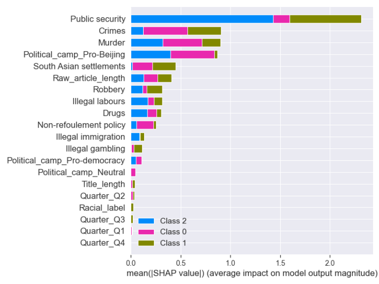
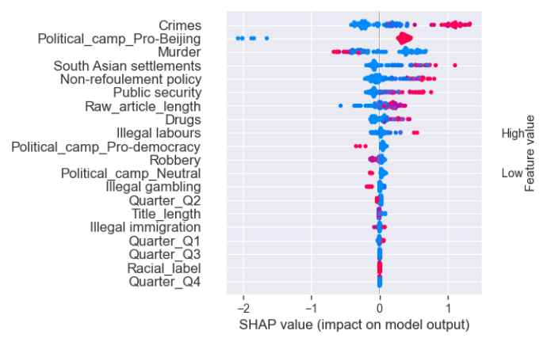
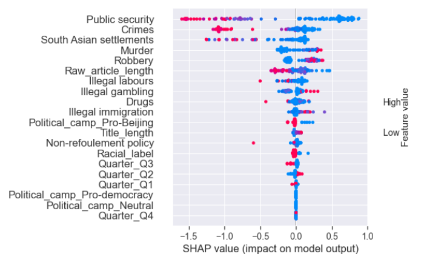

\setcounter{chapter}{3}

```{r python_setup}
library(reticulate)
```

```{python results_modules}
import warnings
import numpy as np
import pandas as pd
import matplotlib.pyplot as plt
import seaborn as sns
import jieba
import zhon.hanzi
import re
from itertools import chain

# Setting options for display and random seed
pd.set_option('display.max_columns', None)
sns.set_theme(context='paper')
warnings.filterwarnings(category=FutureWarning, action = 'ignore')
warnings.filterwarnings(category=UserWarning, action = 'ignore')
```

```{python import_dataset}
news_df = pd.read_csv("Coding/asylum_seekers_articles_final.csv")
num_of_articles = news_df.shape[0]
num_of_newspapers = news_df.Newspaper.nunique()
```

# Results

After the data collection process, there were in total `r py$num_of_articles` articles published in 2019 by `r py$num_of_newspapers` newspapers which reported on non-refoulement claimants residing in Hong Kong. In this section, I will first explore the data set, and then move onto sentiment analysis with machine learning models to find out whether the political camp of media outlets is associated with the polarity of the news articles towards asylum seekers.

## Exploratory data analysis (EDA)

### How does the number of news articles vary by political camps and month?

Starting with the number of articles by media outlets as shown in the left plot of figure 4.1, consistent with the study by @ngFramingIssueAsylum2019, Oriental Daily News continues to be the media outlet covering the most frequently on asylum seekers with 384 (or `r round(384/557 * 100, 2)`%) articles throughout 2019. By contrast, the second-most frequent publisher *Sing Tao Daily* only had 45 entries (or `r round(45/557 * 100, 2)`%) of the total number of articles published. Each of the other newspaper outlets only constituted to a small portion of news articles about non-refoulement claimants in 2019. Therefore, the issue of asylum seekers in Hong Kong still appeared to be the most salient for Oriental Daily News by 2019, evidenced by its unmatched volume of articles related to this topic vis-a-vis other media outlets.

On a higher level of political stance, the right plot of figure 4.1 indicates that largely due to the huge volume of articles by Oriental Daily News, the pro-Beijing camp dominated the coverage of asylum seekers in Hong Kong in 2019. Meanwhile, both neutral and pro-democracy newspaper outlets published similar amounts of articles throughout 2019, and both camps constituted to small proportions of the share of articles during the year. Even if we omitted the sheer volume of articles published by Oriental Daily News, the pro-Beijing media would still have `r 557-384` articles published altogether which was still considerably more than the quantity of articles by neutral and pro-democracy media outlets.

```{python, fig.cap="News articles on asylum seekers in 2019 by news outlet (left) and political camp (right)"}
fig, axes = plt.subplots(1,2)

# Plotting by-outlet amount of articles
articles_outlet = news_df.value_counts('Newspaper')
sns.barplot(x=articles_outlet, y=articles_outlet.index, ax=axes[0])
axes[0].set(xlabel='Number of articles (in base-10 log scale)', ylabel='', title='By newspaper', xscale="log")
for idx, value in enumerate(articles_outlet):
    axes[0].text(value + 5, idx + 0.2, value)

# Plotting by-camp amount of articles
sns.countplot(x='Political_camp', data=news_df, ax=axes[1])    
axes[1].set(xlabel='', ylabel='Number of articles', title='By political camp')
count_by_political_camp = news_df['Political_camp'].value_counts(sort=False)
for idx, value in enumerate(count_by_political_camp):
  axes[1].text(idx - 0.1, value + 5, value)
axes[1].set_xticklabels(['Pro-Beijing', 'Neutral', 'Pro-democracy'], rotation=60)
plt.tight_layout()
plt.show()
plt.clf()
```

It will also be intriguing to see how the number of articles might vary by month in 2019. As noted before, the anti-extradition law protest lasted mostly from June to November when numerous large-scale clashes between protesters and the police occurred. From figure 4.2, it appears that coincidentally, there were the fewest amounts of articles about asylum seekers published between August and November when some of the most intense clashes (notably the siege of the Hong Kong Polytechnic University in November 2019) took place.

```{python, fig.cap="Temporal patterns of the publication of news articles about asylum seekers in Hong Kong in 2019"}
articles_by_month = news_df.Month.value_counts(sort=False)
ax = sns.lineplot(x=articles_by_month.index, y=articles_by_month, color='tab:orange')
ax.set(xlabel='Month', ylabel='Number of articles', xticks=np.arange(1,13))
plt.tight_layout()
plt.show()
plt.clf()
```

In short, the majority of news articles about non-refoulement claimants in Hong Kong in 2019 were published by pro-Beijing media outlets, of which a huge proportion was from Oriental Daily News. Moreover, the number of articles by month was the lowest from August to November when the anti-extradition law witnessed some of the most large-scale and intense clashes.

### Polarities of the news articles

According to table 4.1, the polarity of the news articles about asylum seekers in Hong Kong in 2019 tilted towards negative, since only around 4.3% and 23.5% of articles respectively depicted asylum seekers positively and neutrally. The fact that the sentiment of the news articles in 2019 was skewed towards negativity implies that I will need to take class imbalance into account for modelling later. Political-camp-wise, pro-Beijing media outlets had over 70% of its articles depicting asylum seekers in Hong Kong in negative lights, whereas neutral and pro-democracy media outlets had their reportage evenly spread between neutral and positive articles (albeit they altogether constituted to only a small proportion of the total number of articles in 2019). While H~1~ shall be tested formally with machine learning models after including other control variables later, preliminary evidence suggests that the polarities of the news articles vary with the political camp that the outlets belong to.

```{python}
sentiment_camp = pd.crosstab(news_df.Political_camp, news_df.Sentiment, margins=True)
sentiment_camp.columns = ["Negative", "Neutral", "Positive", "All"]
```

```{r}
knitr::kable(py$sentiment_camp, digits = 4, caption="Polarities of the news articles on asylum seekers in Hong Kong in 2019")
```

### Presence of racial labels

Given the majority of asylum seekers in Hong Kong being non-ethnic Chinese, it will also be worth glimpsing whether the presence of racial labels for describing asylum seekers is associated with the sentiment of the news articles. Judging from figure 4.3 preliminarily, however, it appears that the patterns of the polarities are quite similar whether news articles contain racial labels or not, namely, most of the articles framed non-refoulement claimants negatively, some reported on events about this group of population neutrally, and only a small amount of articles were favourable towards asylum seekers residing in the city. In any case, the machine learning models can add the presence of racial labels as a control variable to test this potential association more formally later.

```{python, fig.cap="Presence of racial labels in the news articles by sentiment"}
ax = sns.countplot(x="Racial_label", hue="Sentiment", data=news_df)
ax.set(xlabel="Presence of racial labels", ylabel="Number of articles")
ax.set_xticklabels(["No", "Yes"])
plt.show()
plt.clf()
```

### Character lengths of news articles and titles

Lastly, let's look at the distribution of the character lengths of the titles and main texts of the news articles. According to figure 4.4 and table 4.2, it appears that both the title and main text lengths have right-skewed distributions. In other words, while most of the news articles on asylum seekers in Hong Kong in 2019 had relatively short titles and/or main texts, a few of them were considerably more verbose than the rest of the articles.

```{python, fig.cap="Distributions of the word counts of the articles' titles (left) and main texts (right)"}
fig, axes = plt.subplots(1, 2)

# Plotting distribution of title word count
sns.histplot(x='Title_length', data=news_df, ax=axes[0], color='tab:blue', alpha=0.5)
axes[0].set(xlabel='Word count', title='Article title')
mean_title_length = news_df.Title_length.mean()
axes[0].axvline(mean_title_length, alpha=0.5, linestyle = '-.', c='black', label='Mean of title length')
axes[0].legend()

# Plotting distribution of article word count
sns.histplot(x='Raw_article_length', data=news_df, ax=axes[1], color='tab:orange', alpha=0.5)
axes[1].set(xlabel='Word count (in thousands)', title='Raw article text')
mean_article_length = news_df.Raw_article_length.mean()
axes[1].axvline(mean_article_length, alpha=0.5, linestyle = '--', c='black', label='Mean of main text length')
axes[1].legend()

# Global setup
plt.tight_layout()
plt.show()
plt.clf()
```

```{python}
article_length_summary = news_df[['Title_length', 'Raw_article_length']].describe()
```

```{r}
knitr::kable(py$article_length_summary, col.names = c("Title", "Raw main text"), caption="Summary statistics of the word counts of the news articles' titles and main texts")
```

## Sentiment analysis

### Preprocessing

After making sense of the dataset with EDA, it is time to build the sentiment analysis model to see whether the political affiliation of news media outlets is associated with the polarities of the news articles after controlling for other variables. But first there are some preprocessing steps to be done so that the data are transformed into suitable formats as inputs for machine learning models. For starters, columns of the metadata should be excluded for being the inputs of the models. Note that I have also removed the `Newspaper` column since H~1~ is more interested in whether newspaper outlets of the pro-Beijing camp *as a whole* may hold more negative attitudes towards asylum seekers in Hong Kong vis-a-vis media outlets with other political stances. The removed metadata columns are: `Index, Date, Category, Page_number` and `Newspaper`.

```{python dropping_metadata_columns}
metadata_columns = ["Index", "Date", "Category", "Page_number", "Newspaper"]
news_df.drop(columns=metadata_columns, inplace=True)
```

Furthermore, I have binned `Month` into four even split yearly quarters (`Quarter`) to reduce the dimensionality of the dataset. A further note on the categorical features is that they will need to be transformed via one-hot encoding, meaning that each of them will be transformed into `n` variables, with `n` being the number of the original distinct values. Meanwhile, it would also be better to standardise the numerical features (i.e. other than `Political_camp` and `Quarter`) by centering theirs means at 0 for better model convergence, but the standardiser should only be fitted on the training set after splitting the data into the training and validation sets in order to avoid data leakage (the same is also true for creating the TF-IDF matrix).

```{python creating_cat_variables}
# Making pro-Beijing become the reference category
news_df["Political_camp"] = pd.Categorical(news_df["Political_camp"], categories=['Pro-Beijing', 'Neutral', 'Pro-democracy'])  

# Binning the months into four quarters
def quarter(x):
  if x <= 3:
    return "Q1"
  elif x <= 6:
    return "Q2"
  elif x <= 9:
    return "Q3"
  else:
    return "Q4"
news_df["Quarter"] = pd.Categorical(news_df.Month.apply(quarter))
news_df.drop(columns="Month", inplace=True)

# One-hot encoding
news_df = pd.get_dummies(news_df, columns=["Political_camp", "Quarter"])
```

```{python train_and_test}
from sklearn.model_selection import train_test_split
X = news_df.drop(columns="Sentiment")
y = news_df.Sentiment
X_train, X_test, y_train, y_test = train_test_split(X, y, test_size=0.2, stratify=y, random_state=1)
```

The next step is to transform both the titles and main texts of the articles into a TF-IDF term-document matrix. Apart from joining the `Title` and `Text` columns together as the complete `Article`, I will also add additional words into the dictionary and remove stop words as well as punctuation for better tokenisation so that the `NMF` model can better discover the latent topics.

```{python joining_title_and_text}
# Train set
X_train["Article"] = X_train.Title.str.cat(news_df.Text, sep=" ")
X_train.drop(columns=["Text", "Title"], inplace=True)

# Test set
X_test["Article"] = X_test.Title.str.cat(news_df.Text, sep=" ")
X_test.drop(columns=["Text", "Title"], inplace=True)
```

```{python read_text_function}
def read_text(path):
    with open(path, 'r', encoding='utf-8') as file:
        text = file.readlines()
        text = [word.replace('\n', '') for word in text]
        return text
```

```{python adding_words_to_dict, include=FALSE}
hk_politics_words = read_text('Coding/HKPolDict-master/merged.txt')  # Words related to Hong Kong politics
asylum_seeker_words = read_text('Coding/Asylum_seeker_words.txt')  # Words related to asylum seekers in Hong Kong
for word in chain(hk_politics_words, asylum_seeker_words):
  jieba.add_word(word)
```

```{python stop_word_list}
stop_words_cantonese = read_text('Coding/text_cleaning/cantonese_stopwords.txt')
punctuations = [punc for punc in zhon.hanzi.punctuation]
stop_words_full = list(set(word for word in chain(stop_words_cantonese, punctuations)))  
```

To avoid data leakage as mentioned before, I will only fit the `TfidfVectorizer` and the `NMF` models on the train set (i.e. `X_train`) and then use the fitted instances to transform both the train and test sets. I set the number of latent topics (`n_components`) as 10 for the `NMF` model, and this is decided based on figure 4.5 which plots the reconstruction error measuring the difference of the values between the original TF-IDF matrix and the reconstructed version after NMF. Although there are certainly other valid choices of the number of latent topics to be discovered by NMF, `10` appears to be a reasonable choice as a compromise between finding out a wide variety of topics in the corpus and not fitting too much into the noise of the data.

```{python tokeniser_setup}
# tokenizer
def tokenize_zh(doc):
  return jieba.cut(doc)

# Preprocessor
def preprocessor_zh(doc):
  regex_punctuation = r"[\d+\s+\n\t]|[\s+\.\!\/_,$%^*(+\"\']+|[+——！，。？、~@#￥%……&*（）]+|[【】╮╯▽╰╭★→「」]+|[！，❤。～《》：（）【】「」？”“；：、]"
  return re.sub(regex_punctuation, "", doc)
```

```{python, fig.cap="Elbow plot of the reconstruction error of NMF as a function of the number of pre-specified latent topics"}
from sklearn.feature_extraction.text import TfidfVectorizer
from sklearn.decomposition import NMF

# Creating the tfidf matrix from the training set
tfidf_vec = TfidfVectorizer(min_df = 0.02,  # Each token must appear in at least 2% of the documents
                            preprocessor=preprocessor_zh, 
                            tokenizer=tokenize_zh, 
                            stop_words=stop_words_full)
X_train_tfidf = tfidf_vec.fit_transform(X_train.Article)

# Plotting the reconstruction error according to the number of latent topics
reconstruct_error = []
for i in range(1, 21):
  nmf = NMF(n_components=i, max_iter=500, random_state=1)
  articles_nmf = nmf.fit(X_train_tfidf)
  reconstruct_error.append(nmf.reconstruction_err_)

ax = sns.lineplot(x=np.arange(1, 21), y=reconstruct_error)
ax.set(xlabel="Number of latent topics", ylabel="Reconstruction error", xticks=np.arange(1, 21))
plt.show()
plt.clf()

# Let's set n_components as 10 for nmf
nmf_10 = NMF(n_components=10, max_iter=500, random_state=1)
X_train_nmf = nmf_10.fit_transform(X_train_tfidf)
```

In order to make the latent topics generated by the NMF model be named more intuitive, I will inspect the 30 most prominent words of each latent topic and then summarise each topic[^1]. Overall, the ten topics generated by NMF are more or less semantically coherent and can be summed up concisely. Finally, I will transform the validation set's articles with the fitted instance of the TF-IDF and NMF models on the training set. The ten latent topics that were discovered by the NMF model are: *crimes, non-refoulement policy, illegal labours , illegal gambling, drugs, illegal immigration, murder, robbery, South Asian settlements* and *public security.*

[^1]: A list of the 30 most prominent words in each of the topic and the code to generate it are available in the appendix.

```{python latent_topic_df, include=FALSE}
# Naming the latent topics more precisely
topics_list = ["Crimes", "Non-refoulement policy", "Illegal labours", "Illegal gambling", "Drugs", "Illegal immigration", "Murder", "Robbery", "South Asian settlements", "Public security"]

# Concatenating the NMF DataFrame for the training set
X_train_nmf_df = pd.DataFrame(X_train_nmf, index=X_train.index, columns=topics_list)
X_train_final = pd.concat([X_train, X_train_nmf_df], axis=1)
X_train_final.drop(columns="Article", inplace=True)

# Concatenating the NMF DataFrame for the validation set
X_test_tfidf = tfidf_vec.transform(X_test.Article)
X_test_nmf = nmf_10.transform(X_test_tfidf)
X_test_nmf_df = pd.DataFrame(X_test_nmf, index=X_test.index, columns=topics_list)
X_test_final = pd.concat([X_test, X_test_nmf_df], axis=1)
X_test_final.drop(columns="Article", inplace=True)

```

### Training the model

After the above preprocessing steps, it is time to train a model that adequately predicts the relations between the features and the sentiment of the articles before finding out the importance of the political camp as the main independent variable. To facilitate the decision of which model to use and model tuning, I will first run some baseline models with the default hyper-parameters, except that I have adjusted the weights of each class in the dependent variable due to class imbalance and also tweaked the `n_estimators` of the XGBoost model to 15 instead of the default value of 200 to prevent the model from being too big[^2]. Moreover, tree-based models (i.e. random forest and xgboost) do not necessarily need to have the numerical features standardised, and thus only the categorical columns need to be one-hot encoded. The baseline models will be compared based on their performance on log loss in 5-fold cross validation and on the testing set.

[^2]: For the complete documentation of the default parameters of the models used in this thesis, refer to the websites of [scikit-learn](scikit-learn:%20machine%20learning%20in%20Python%20—%20scikit-learn%201.0.2%20documentation) and [XGBoost Documentation --- xgboost 1.5.1 documentation](https://xgboost.readthedocs.io/en/stable/).

```{python evaluation_metric}
from sklearn.model_selection import cross_val_score, StratifiedKFold
from sklearn.metrics import log_loss

# Defining the kfold strategy
five_fold_cv = StratifiedKFold(n_splits=5, shuffle=True, random_state=1)

# Utility function for evaluating the model's performance in cross validation and test set in terms of log loss
def evaluate_model(model, model_name: str, cv=five_fold_cv, X_train=X_train_final, X_test=X_test_final, y_train=y_train, y_test=y_test):
  cv_log_loss = np.mean(-cross_val_score(model, X_train, y_train, cv=cv, scoring="neg_log_loss"))
  y_pred_proba = model.predict_proba(X_test)
  test_log_loss = log_loss(y_test, y_pred_proba)
  return {"5-fold cv log loss": cv_log_loss, "Test set log loss": test_log_loss}
  
```

```{python preprocessing}
from sklearn.preprocessing import StandardScaler, OneHotEncoder
from sklearn.compose import ColumnTransformer

# Separating the columns for respective preprocessing steps
numeric_columns = [col for col in X_train_final.columns if X_train_final[col].dtype in ["int64", "float64"] and col != "Racial_label"]

# Preprocessor for linear models
stand_preprocessor = ColumnTransformer([("standardiser", StandardScaler(), numeric_columns)],
                                         remainder='passthrough')
_ = stand_preprocessor.fit(X_train_final)

```

```{python baseline_models}
from sklearn.linear_model import LogisticRegression
from sklearn.svm import SVC
from sklearn.ensemble import RandomForestClassifier
from sklearn.pipeline import Pipeline
from sklearn.utils.class_weight import compute_sample_weight
import xgboost as xgb

# Logistic regression pipeline
log_reg_baseline = Pipeline([("preprocess", stand_preprocessor), 
                             ("log_reg", LogisticRegression(random_state=1,  
                                                            class_weight="balanced"))])
_ = log_reg_baseline.fit(X_train_final, y_train)
log_reg_base_result = evaluate_model(log_reg_baseline, "baseline logistic regression")

# SVM pipeline
svm_baseline = Pipeline([("preprocess", stand_preprocessor), 
                         ("svm", SVC(probability=True, class_weight="balanced", random_state=1))])
_ = svm_baseline.fit(X_train_final, y_train)
svm_base_result = evaluate_model(svm_baseline, "baseline support vector machine")

# Random forest pipeline
rf_baseline = RandomForestClassifier(class_weight="balanced", random_state=1, criterion="entropy")
_ = rf_baseline.fit(X_train_final, y_train)
rf_base_result = evaluate_model(rf_baseline, "baseline random forest")

# xgboost pipeline
xgb_sample_weight = compute_sample_weight(class_weight="balanced", y=y_train)
xgboost_baseline = xgb.XGBClassifier(n_estimators=15,
                                     objective="multi:softmax",
                                     eval_metric="mlogloss",
                                     seed=1, 
                                     use_label_encoder=False)
_ = xgboost_baseline.fit(X_train_final, 
                         y_train, 
                         sample_weight=xgb_sample_weight)
xgb_base_result = evaluate_model(xgboost_baseline, "baseline XGBoost")

# Creating the DataFrame of the baseline results
baseline_log_loss_df = pd.DataFrame([log_reg_base_result, svm_base_result, rf_base_result, xgb_base_result], index=["Logistic regression", "SVM", "Random forest", "XGBoost classifier"])

```

```{r}
knitr::kable(py$baseline_log_loss_df, caption = "Log loss on 5-fold cv and test set for the 4 baseline models")

```

Table 4.3 contains the performance of the log loss on both the 5-fold cross validation and test set log loss scores for the four baseline models. Judging by the performance of log loss on the test set, it seems that the XGBoost model performs the best out of all candidates. I will then perform hyper-parameter tuning of the XGBoost model to see if there could be any improvements of its performance[^3]. Surprisingly, the tuned XGBoost model has a higher log loss on the test data than the pre-tuned one. If we look at the per-class f1 score in tables 4.4 and 4.5, however, we can see that the tuned XGBoost model performs considerably better in the f1 score for predicting whether a news article's polarity is positive or not (i.e., class `2`). Therefore, I will use the tuned model as the basis of interpreting the impact of the features on predicting the sentiments of the news articles about asylum seekers in Hong Kong in 2019.

[^3]: The code for tuning the model can be found in the appendix.

```{python comparing_tuned_and_baseline}
# Loading the tuned model
import pickle
xgboost_tuned = pickle.load(open("xgb_clf.pkl", "rb"))

# Creating the DataFrames for f1 score of both baseline and tuned models
from sklearn.metrics import classification_report
xgb_base_class_report = pd.DataFrame(classification_report(y_test, xgboost_baseline.predict(X_test_final), output_dict=True)).T
xgb_tuned_class_report = pd.DataFrame(classification_report(y_test, xgboost_tuned.predict(X_test_final), output_dict=True)).T

```

```{r}
knitr::kable(py$xgb_base_class_report, digits=4, caption="Classification report of the baseline XGBoost model")

```

```{r}
knitr::kable(py$xgb_tuned_class_report, digits=4, caption="Classification report of the tuned XGBoost model")

```

### Is the pro-Beijing camp more likely to portray asylum seekers in 2019 more negatively than other outlets?

With the trained model at hand, we can now answer whether H~1~ is supported by the model's results using SHAP values. According to figure 4.6, we can see that on the level of the whole XGBoost model, whether a media belongs to the pro-Beijing camp or not (`Political_camp_Pro-Beijing`) is the fourth most important features in predicting the sentiment of a news article, only being lower than the magnitudes of three themes of the news articles about asylum seekers (i.e., public security, murder and crimes). Specifically, pro-Beijing affiliation has the second largest magnitude in affecting the prediction of whether a news article has a negative narrative against non-refoulement claimants, as one can see the pink bar representing the impact of a feature on predicting class `0` in the model is the second longest for the `Political_camp_Pro-Beijing` feature (only behind that of the theme `Crimes` in the articles). Let's zoom into the SHAP values plot for predicting class `0`.

```{python defining_shap_plot_func, include=FALSE}
# Setting up the shap values 
import shap
xgb_explainer = shap.TreeExplainer(xgboost_tuned)
xgb_shap_values = xgb_explainer.shap_values(X_test_final)

# Defining the plotting function
def plot_shap_values(class_label=None, **kwargs):
  plt.tight_layout()
  if class_label == None:
    shap.summary_plot(xgb_shap_values, X_test_final, **kwargs)
  else:
    shap.summary_plot(xgb_shap_values[class_label], X_test_final, **kwargs)
    
    
```

```{r, fig.cap="Overall SHAP values of the features in the tuned XGBoost model", out.width = "100%"}

```

The beeswarm plot in figure 4.7 zooms into the importance of each feature in predicting whether a news article on asylum seekers has a negative (coded as `0`) polarity, and features appearing at the top of the y-axis are deemed more important than those at the lower end of the y-axis. In a SHAP value beeswarm plot, dots in red mean the value of a feature is high (or present in case of a binary feature, e.g. one-hot-encoded columns), whereas those in blue mean the value of a feature is low (or absent in the case of a binary feature). As one can see, not only is the affiliation to pro-Beijing camp the second most determinant feature in predicting whether a news article has negative polarity, but such affiliation will also increase the probability of a news articles portraying asylum seekers in negative lights.

```{r, out.width = "100%", fig.cap="The SHAP values of the features in the prediction of whether an article has a negative polarity"}

```

If we inquire further in figures 4.8 and 4.9 about the impact of the features on the predictions of neutral and positive articles respectively, then some interesting observations arise. Firstly, pro-Beijing affiliation is not a very prominent feature in affecting the prediction of whether a news article is simply reporting on news related to asylum seekers objectively without much added sentiment and interpretation by the journalists, as figure 4.8 shows that the `Political_camp_Pro-Beijing` only occupies the middle layer of the y-axis and does not have a significant magnitude in affecting the prediction. By contrast, pro-Beijing affiliation of a media outlet once again is the second most important feature for the prediction of whether an article depicts asylum seekers in Hong Kong favourably. In particular, pro-Beijing media outlets are less likely to have positive reportage on non-refoulement claimants vis-a-vis media outlets from other camps.

```{r, out.width="100%", fig.cap="The SHAP values of the features in the prediction of whether an article has a neutral polarity"}

```

```{r, out.width="100%", fig.cap="The SHAP values of the features in the prediction of whether an article has a positive polarity"}
knitr::include_graphics("SHAP_positive.png")
```

Based on the SHAP values of the features as shown in figures 4.6-4.9, we can therefore conclude that H~1~ is supported by the evidence produced from the above sentiment analysis on the articles about asylum seekers in Hong Kong in 2019. Specifically, pro-Beijing media outlets are more likely to frame asylum seekers negatively by using incorrect terms such as "fake refuges" to refer to this group of population or criticising them as social ills, and these media outlets are quite unlikely to have favourable reportage on non-refoulement claimants.

Here are also some notable observations about other features in the dataset. For starters, it seems that when news articles are related to the topic of `Public security`, then their polarities are less likely to be neutral, meaning that such reportage is likely to be loaded with interpretations by the media outlets. Referring to figures 4.7 and 4.9, in general, articles which link non-refoulement claimants with the frame of public security are less likely to have positive polarity. Relatedly, articles reporting on crimes with involvement by non-refoulement claimants are likely to have negative tones.

Surprisingly, racial labels was not an informative feature in predicting the sentiment of the articles. One potential reason may be that the connotation between non-ethnic Chineseness and non-refoulement claimants is quite salient that these two categories may to some extent be used interchangeably, or the media find it difficult to not mention both at the same time no matter the sentiment or attitudes towards asylum seekers in Hong Kong.

## Discussion

In general, the above results are consistent with those found by \@ngFramingIssueAsylum2019 when the issue of non-refoulement claimants . Although this thesis focuses less on *how* non-refoulement claimants are portrayed ,

One question about the validity of the analysis result can be that the vast volume of publication about asylum seekers by Oriental Daily News might have skewed the pro-Beijing media's attitudes towards asylum seekers towards the negative ends. While it is certainly a fact that Oriental Daily News covered non-refoulement claimants disproportionately throughout 2019,

However,
