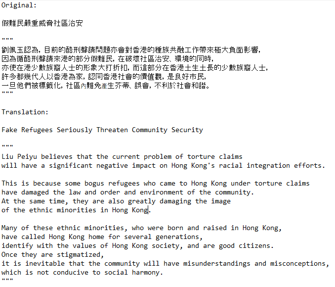

\setcounter{chapter}{3}

```{r python_setup}
library(reticulate)
```

```{python results_modules}
import warnings
import numpy as np
import pandas as pd
import matplotlib.pyplot as plt
import seaborn as sns
import jieba
import zhon.hanzi
import re
from itertools import chain

# Setting options for display and random seed
np.random.seed(1)
pd.set_option('display.max_columns', None)
sns.set_theme(context='paper')
warnings.filterwarnings(category=FutureWarning, action = 'ignore')
warnings.filterwarnings(category=UserWarning, action = 'ignore')
```

```{python import_dataset}
news_df = pd.read_csv("data/asylum_seekers_articles_final.csv")
num_of_articles = news_df.shape[0]
num_of_newspapers = news_df.Newspaper.nunique()
```

# Results

After the data collection process, there were in total `r py$num_of_articles` articles published in 2019 by `r py$num_of_newspapers` newspapers which reported on non-refoulement claimants residing in Hong Kong. I will first preliminarily explore the variables in the data set before moving to sentiment analysis with machine learning models to find out whether the political camp of media outlets is associated with the polarity of the news articles towards asylum seekers. Interpretation of the model's results will be provided afterwards.

## Exploratory data analysis (EDA)

### Number of news articles by month

Figure 4.1 shows how the number of news articles on non-refoulement claimants varied by month in 2019. It appears that coincidentally, there were fewer articles about asylum seekers published between August and November when some of the most intense clashes (notably the siege of the Hong Kong Polytechnic University in November 2019) took place, and only until December did the amount of published articles about non-refoulement claimants rebound to the level in July. As for the first half of 2019, the amount of articles published by month fluctuated quite a bit as seen from the zig-zag pattern of the line graph during this period.

```{python, fig.cap="The volume of publication of news articles about asylum seekers by month in Hong Kong in 2019"}
articles_by_month = news_df.Month.value_counts(sort=False)
ax = sns.lineplot(x=articles_by_month.index, y=articles_by_month, color='tab:orange')
ax.set(xlabel='Month', ylabel='Number of articles', xticks=np.arange(1, 13))
plt.tight_layout()
plt.show()
plt.clf()
```

### Polarities of the news articles

According to table 4.1, the polarity of the news articles about asylum seekers in Hong Kong in 2019 tilted towards *negative*, since only around 4.3% and 23.5% of articles depicted asylum seekers positively and neutrally respectively. The fact that the sentiment of the news articles in 2019 was skewed towards negativity implies that I will need to take class imbalance into account for modelling later. Political-camp-wise, pro-Beijing media outlets had over 70% of its articles depicting asylum seekers in Hong Kong in negative lights, whereas neutral and pro-democracy media outlets had their reportage evenly spread between neutral and positive articles (albeit they altogether constituted to only a small proportion of the total number of articles in 2019). While H~1~ shall be tested formally with machine learning models after including other control variables later, preliminary evidence suggests that the polarities of the news articles vary with the political camp that the outlets belong to.

```{python}
sentiment_camp = pd.crosstab(news_df.Political_camp, news_df.Sentiment, margins=True)
sentiment_camp.columns = ["Negative", "Neutral", "Positive", "All"]
```

```{r}
knitr::kable(py$sentiment_camp, digits = 4, caption="Polarities of the news articles (on columns) on asylum seekers by political camps (on rows) in Hong Kong in 2019")
```

### Presence of racial labels

Given the majority of asylum seekers in Hong Kong being non-ethnic Chinese, it will also be worth glimpsing whether the presence of racial labels for describing asylum seekers is associated with the sentiment of the news articles. Judging from figure 4.2 preliminarily, however, it appears that the patterns of the polarities are quite similar no matter if news articles contain racial labels or not, namely, most of the articles framed non-refoulement claimants negatively, some reported on events about this group of population neutrally, and only a small amount of articles were favourable towards asylum seekers residing in the city. Machine learning models can test whether there is any association between racial labels and the polarity of news articles more formally later.

```{python, fig.cap="Presence of racial labels in the news articles by sentiment in 2019"}
ax = sns.countplot(x="Racial_label", hue="Sentiment", data=news_df)
ax.set(xlabel="Presence of racial labels", ylabel="Number of articles")
ax.set_xticklabels(["No", "Yes"])
ax.legend(labels=["Negative", "Neutral", "Positive"], title="Sentiment")
plt.show()
plt.clf()
```

### Character lengths of news articles and titles

Lastly, let's look at the distribution of the character lengths of the titles and main texts of the news articles. According to figure 4.3 and table 4.2, it appears that both the title and main text lengths have right-skewed distributions. In other words, while most of the news articles on asylum seekers in Hong Kong in 2019 had relatively short titles and/or main texts, a few of them were considerably more verbose than the rest.

```{python, fig.cap="Distributions of the word counts of the news articles' titles (left) and main texts (right)"}
fig, axes = plt.subplots(1, 2)

# Plotting distribution of title word count
sns.histplot(x='Title_length', data=news_df, ax=axes[0], color='tab:blue', alpha=0.5)
axes[0].set(xlabel='Word count', title='Article title')
mean_title_length = news_df.Title_length.mean()
axes[0].axvline(mean_title_length, alpha=0.5, linestyle = '-.', c='black', label='Mean of title length')
axes[0].legend()

# Plotting distribution of article word count
sns.histplot(x='Raw_article_length', data=news_df, ax=axes[1], color='tab:orange', alpha=0.5)
axes[1].set(xlabel='Word count', title='Raw article text')
mean_article_length = news_df.Raw_article_length.mean()
axes[1].axvline(mean_article_length, alpha=0.5, linestyle = '--', c='black', label='Mean of main text length')
axes[1].legend()

# Global setup
plt.tight_layout()
plt.show()
plt.clf()
```

```{python}
article_length_summary = news_df[['Title_length', 'Raw_article_length']].describe()
```

```{r}
knitr::kable(py$article_length_summary, col.names = c("Title", "Raw main text"), caption="Summary statistics of the word counts of the news articles' titles and main texts")
```

## Sentiment analysis

### Pre-processing

After making sense of the dataset with EDA, it is time to build the sentiment analysis model to see whether the political affiliation of news media outlets is associated with the polarities of the news articles after controlling for other variables. But first there are some pre-processing steps to be done so that the data are transformed into suitable formats as inputs for machine learning models. For starters, columns of the metadata should be excluded from being the inputs of the models. Note that I have also removed the `Newspaper` column since H~1~ is more interested in whether newspaper outlets of the pro-Beijing camp *as a whole* may hold more negative attitudes towards asylum seekers in Hong Kong vis-a-vis media outlets with other political stances. The removed metadata columns are: `Index`, `Date`, `Category`, `Page_number` and `Newspaper`.

```{python dropping_metadata_columns}
metadata_columns = ["Index", "Date", "Category", "Page_number", "Newspaper"]
news_df.drop(columns=metadata_columns, inplace=True)
```

For the categorical features, they will need to be one-hot encoded, meaning that each of them will be transformed into `n` (i.e. the number of distinct values in each categorical feature) new columns, and the presence of a category will be marked with `1` in the respective column for an observation and `0` for other columns. Meanwhile, it would also be better to standardise the numerical features (i.e. other than `Political_camp`, `Racial label` and `Quarter`) by centering their means at 0 for better model convergence, but the standardiser should only be fitted on the *training set* after splitting the data into the training and testing sets in order to avoid data leakage (the same is also true for creating the TF-IDF matrix). As mentioned before, 20% of the observations in the dataset will be split into the test data for model validation later.

```{python creating_cat_variables}
# Making pro-Beijing become the reference category
news_df["Political_camp"] = pd.Categorical(news_df["Political_camp"], categories=['Pro-Beijing', 'Neutral', 'Pro-democracy'])  

# Binning the months into four quarters
def quarter(x):
  if x <= 3:
    return "Q1"
  elif x <= 6:
    return "Q2"
  elif x <= 9:
    return "Q3"
  else:
    return "Q4"
news_df["Quarter"] = pd.Categorical(news_df.Month.apply(quarter))
news_df.drop(columns="Month", inplace=True)
```

```{python ohe_and_split}
from sklearn.model_selection import train_test_split

# One-hot encoding
news_df = pd.get_dummies(news_df, columns=["Political_camp", "Quarter"])

# Splitting data into train and test sets
X = news_df.drop(columns="Sentiment")
y = news_df.Sentiment
X_train, X_test, y_train, y_test = train_test_split(X, y, 
                                                    test_size=0.2, 
                                                    stratify=y, 
                                                    random_state=1)
```

The next step is to transform both the titles and main texts of the articles into a TF-IDF term-document matrix. Apart from joining the `Title` and `Text` columns together as the complete `Article`, I will also add additional words into the dictionary and remove stop words as well as punctuation for better tokenisation so that the `NMF` model can better discover the latent topics.

```{python joining_title_and_text}
# Train set
X_train["Article"] = X_train.Title.str.cat(news_df.Text, sep=" ")
X_train.drop(columns=["Text", "Title"], inplace=True)

# Test set
X_test["Article"] = X_test.Title.str.cat(news_df.Text, sep=" ")
X_test.drop(columns=["Text", "Title"], inplace=True)
```

```{python read_text_function}
def read_text(path):
    with open(path, 'r', encoding='utf-8') as file:
        text = file.readlines()
        text = [word.replace('\n', '') for word in text]
        return text
```

```{python adding_words_to_dictm, include=FALSE}
hk_politics_words = read_text('Coding/HKPolDict-master/merged.txt')  # Words related to Hong Kong politics
asylum_seeker_words = read_text('Coding/Asylum_seeker_words.txt')  # Words related to asylum seekers in Hong Kong
for word in chain(hk_politics_words, asylum_seeker_words):
  jieba.add_word(word)
```

```{python stop_word_list}
stop_words_cantonese = read_text('Coding/text_cleaning/cantonese_stopwords.txt')
punctuations = [punc for punc in zhon.hanzi.punctuation]
stop_words_full = list(set(word for word in chain(stop_words_cantonese, punctuations)))  
```

To avoid data leakage as mentioned before, I will only fit the `TfidfVectorizer` and the `NMF` models on the training set and then use the fitted instances to transform both the train and test data. I set the number of latent topics (`n_components`) as 10 for the `NMF` model, and this is decided based on figure 4.4 which plots the reconstruction error measuring the difference of the values between the original TF-IDF matrix and the reconstructed version after NMF. Although there are certainly other valid choices of the number of latent topics to be discovered by NMF, `10` appears to be a reasonable choice as a compromise between finding out a wide variety of topics in the corpus and not fitting too much into the noise of the data.

```{python tokeniser_setup}
# tokenizer
def tokenize_zh(doc):
  return jieba.cut(doc)

# Preprocessor
def preprocessor_zh(doc):
  regex_punctuation = r"[\d+\s+\n\t]|[\s+\.\!\/_,$%^*(+\"\']+|[+——！，。？、~@#￥%……&*（）]+|[【】╮╯▽╰╭★→「」]+|[！，❤。～《》：（）【】「」？”“；：、]"
  return re.sub(regex_punctuation, "", doc)
```

```{python, fig.cap="Elbow plot of the reconstruction error of NMF as a function of the number of pre-specified latent topics"}
from sklearn.feature_extraction.text import TfidfVectorizer
from sklearn.decomposition import NMF

# Creating the tfidf matrix from the training set
tfidf_vec = TfidfVectorizer(min_df = 0.02,  # Each token must appear in at least 2% of the documents
                            preprocessor=preprocessor_zh, 
                            tokenizer=tokenize_zh, 
                            stop_words=stop_words_full)
X_train_tfidf = tfidf_vec.fit_transform(X_train.Article)

# Plotting the reconstruction error according to the number of latent topics
reconstruct_error = []
for i in range(1, 21):
  nmf = NMF(n_components=i, max_iter=500, random_state=1)
  articles_nmf = nmf.fit(X_train_tfidf)
  reconstruct_error.append(nmf.reconstruction_err_)

ax = sns.lineplot(x=np.arange(1, 21), y=reconstruct_error)
ax.set(xlabel="Number of latent topics", ylabel="Reconstruction error", xticks=np.arange(1, 21))
plt.show()
plt.clf()

# Let's set n_components as 10 for nmf
nmf_10 = NMF(n_components=10, max_iter=500, random_state=1)
X_train_nmf = nmf_10.fit_transform(X_train_tfidf)
```

In order to make the latent topics generated by the NMF model be named more intuitive, I will inspect the 30 most prominent words of each latent topic (which are shown in figure 4.5) and then summarise each topic. Overall, the ten topics generated by NMF are more or less semantically coherent. Finally, I will transform the testing set's articles with the fitted instances of the TF-IDF and NMF models on the training set.

The ten latent topics (from topics 1 to 10) that were discovered by the NMF model can be named as: *crimes, non-refoulement legal procedure, illegal labours, illegal gambling, drugs, illegal immigration, murder, robbery, South Asian settlements* and *problem and solution*. The *problem and solution* topic refers to the coverage on whether and how non-refoulement claimants should be treated as a social problem and how this should be "solved" accordingly, and it should be noted that the scope of this topic is broader than the rest, meaning that there is likely to be more ways of how this topic can be covered by newspapers. The resulting NMF matrix will be in the shape of `r py$num_of_articles` rows with 10 columns, meaning that each news article will be on its own row in which the 10 columns will indicate the weights of the ten latent topics discovered by the NMF model. The higher the weight of a topic, the more emphasised this topic is in an article, and multiple topics may be co-mentioned within a news articles albeit with different weights.

```{python nmf_topic_word_list, include=FALSE}
# Defining a function to extract the most prominent words in each topic
def topic_words(model, vectorizer, top_n_words):
  vocabulary = vectorizer.get_feature_names()
  for idx, topic in enumerate(model.components_):
    print(f"\nTopic {idx + 1}: ")
    print(" ".join([vocabulary[i] for i in topic.argsort()[:-top_n_words - 1: -1]]))

# Extracting the 30 most prominent words in each topic
_ = topic_words(nmf_10, tfidf_vec, 30)  # the output is shown in figure 4.5
```

```{r, out.width="100%", out.height="100%", fig.cap="Word list of each of the topics generated by the NMF model", out.width="100%"}
knitr::include_graphics("figures/nmf_topic_words_list.png")
```

```{python latent_topic_df, include=FALSE}
# Naming the latent topics more precisely
topics_list = ["Crimes", "Non-refoulement legal procedure", "Illegal labours", "Illegal gambling", "Drugs", "Illegal immigration", "Murder", "Robbery", "South Asian settlements", "Problem and solution"]

# Concatenating the NMF DataFrame for the training set
X_train_nmf_df = pd.DataFrame(X_train_nmf, index=X_train.index, columns=topics_list)
X_train_final = pd.concat([X_train, X_train_nmf_df], axis=1)
X_train_final.drop(columns="Article", inplace=True)

# Concatenating the NMF DataFrame for the validation set
X_test_tfidf = tfidf_vec.transform(X_test.Article)
X_test_nmf = nmf_10.transform(X_test_tfidf)
X_test_nmf_df = pd.DataFrame(X_test_nmf, index=X_test.index, columns=topics_list)
X_test_final = pd.concat([X_test, X_test_nmf_df], axis=1)
X_test_final.drop(columns="Article", inplace=True)

```

### Training the model

After the above pre-processing steps, it is time to train a machine learning model that can adequately predict the relations between the features and the sentiment of the articles before finding out the importance of political camp as the main independent variable. To facilitate the decision of which model to use, I will first run some baseline models with the default hyper-parameters, except that I have adjusted the weights of each class in the dependent variable due to the class imbalance problem mentioned earlier and also set the `early_stopping_rounds` argument to `5` to prevent overfitting while training the XGBoost model[^10]. Moreover, tree-based models (i.e. random forest and XGBoost) do not necessarily need to have the numerical features standardised, and thus only the categorical columns need to be one-hot encoded. The baseline models will be compared based on their performance on the *macro* average f1 score (which is simply the unweighted average of per-class f1 scores, @pedregosaScikitlearnMachineLearning2011) on the testing set and 5-fold cross validation. I chose the macro average f1 score because there is no apparent reason for treating the prediction of one polarity of the news articles to be more important than others.

[^10]: For the complete documentation of the default parameters of the models used in this thesis, refer to the websites of [scikit-learn](scikit-learn:%20machine%20learning%20in%20Python%20—%20scikit-learn%201.0.2%20documentation) and [XGBoost Documentation --- xgboost 1.5.1 documentation](https://xgboost.readthedocs.io/en/stable/).

```{python evaluation_metric}
from sklearn.model_selection import cross_val_score, StratifiedKFold
from sklearn.metrics import f1_score, make_scorer

# Defining the kfold strategy
five_fold_cv = StratifiedKFold(n_splits=5, shuffle=True, random_state=1)

# Utility function for evaluating the model's performance in cross validation and test data in terms of log loss
def evaluate_model_f1(model, model_name: str, cv=five_fold_cv, X_train=X_train_final, X_test=X_test_final, y_train=y_train, y_test=y_test):
  y_pred = model.predict(X_test)
  cv_f1_score = np.mean(cross_val_score(model, X_train, y_train, cv=cv, scoring=make_scorer(f1_score, average="macro")))
  test_f1_score = f1_score(y_test, y_pred, average="macro")
  return {"5-fold cv f1 score": cv_f1_score, "Test data f1 score": test_f1_score}
  
```

```{python preprocessing}
from sklearn.preprocessing import StandardScaler
from sklearn.compose import ColumnTransformer

# Separating the columns for respective preprocessing steps
numeric_columns = [col for col in X_train_final.columns if X_train_final[col].dtype in ["int64", "float64"] and col != "Racial_label"]

# Preprocessor for linear models
stand_preprocessor = ColumnTransformer([("standardiser", StandardScaler(), numeric_columns)], remainder='passthrough')

```

```{python baseline_models}
from sklearn.linear_model import LogisticRegression
from sklearn.svm import SVC
from sklearn.ensemble import RandomForestClassifier
from sklearn.pipeline import Pipeline
from sklearn.utils.class_weight import compute_sample_weight
import xgboost as xgb

# Logistic regression pipeline
log_reg_baseline = Pipeline([("preprocess", stand_preprocessor), 
                             ("log_reg", LogisticRegression(random_state=1,  
                                                            class_weight="balanced"))])
_ = log_reg_baseline.fit(X_train_final, y_train)
log_reg_base_result = evaluate_model_f1(log_reg_baseline, "baseline logistic regression")

# SVM pipeline
svm_baseline = Pipeline([("preprocess", stand_preprocessor), 
                         ("svm", SVC(probability=True, class_weight="balanced", random_state=1))])
_ = svm_baseline.fit(X_train_final, y_train)
svm_base_result = evaluate_model_f1(svm_baseline, "baseline support vector machine")

# Random forest pipeline
rf_baseline = RandomForestClassifier(class_weight="balanced", random_state=1, criterion="entropy")
_ = rf_baseline.fit(X_train_final, y_train)
rf_base_result = evaluate_model_f1(rf_baseline, "baseline random forest")

# xgboost pipeline
xgb_sample_weight = compute_sample_weight(class_weight="balanced", y=y_train)
xgboost_baseline = xgb.XGBClassifier(objective="multi:softmax",
                                     eval_metric="mlogloss",
                                     seed=1, 
                                     use_label_encoder=False)
_ = xgboost_baseline.fit(X_train_final, 
                         y_train, 
                         sample_weight=xgb_sample_weight, 
                         eval_set=[(X_test_final, y_test)], 
                         early_stopping_rounds=5, 
                         verbose=0)
xgb_base_result = evaluate_model_f1(xgboost_baseline, "baseline XGBoost")

# Creating the DataFrame of the baseline results
baseline_f1_score_df = pd.DataFrame([log_reg_base_result, svm_base_result, rf_base_result, xgb_base_result], index=["Logistic regression", "SVM", "Random forest", "XGBoost classifier"])

```

```{r}
knitr::kable(py$baseline_f1_score_df, caption = "F1 scores on 5-fold cross validation and test data of the baseline models")
```

Table 4.3 contains the performance of the macro average f1 scores of the four baseline models on both the 5-fold cross validation and test data. It seems that the two tree-based models perform better than the two linear classifiers (i.e. logistic regression and SVM) in the 5-fold cross validation. Eventually, I decided to go forward with the XGBoost model because the random forest model's f1 score on the test data is more than 0.1 less than that on 5-fold cross validation which is indicative of over-fitting, whereas this was not the case for the XGBoost baseline model. Therefore, I will proceed with XGBoost for hyper-parametering tuning to see if the model's performance can be improved[^11].

[^11]: The code for tuning the model via the package `hyperopt` with Bayesian optimisation can be found in the appendix.

The comparison of the baseline and tuned model's performance in f1 score can be found in table 4.4[^12]. As expected, the tuned XGBoost model performs better on both 5-fold cross validation and the test data (although the magnitude of the increase of the f1 score on the test data should be taken with a grain of salt because of the small number of observations available in the dataset as mentioned before). Table 4.5 further breaks down the f1 score of the tuned XGBoost model on the test data. I will thus calculate the SHAP values of the features with the tuned XGBoost model given its better overall performance.

[^12]: Hyper-parameters of the tuned XGBoost model used here are: {'objective': 'multi:softprob', 'use_label_encoder': False, 'base_score': 0.5, 'booster': 'gbtree', 'colsample_bylevel': 1, 'colsample_bynode': 1, 'colsample_bytree': 0.6000000000000001, 'enable_categorical': False, 'gamma': 0.5, 'gpu_id': -1, 'importance_type': None, 'interaction_constraints': '', 'learning_rate': 0.37, 'max_delta_step': 0, 'max_depth': 5, 'min_child_weight': 3.0, 'missing': nan, 'monotone_constraints': '()', 'n_estimators': 40, 'n_jobs': 16, 'num_parallel_tree': 1, 'predictor': 'auto', 'random_state': 1, 'reg_alpha': 0, 'reg_lambda': 12.0, 'scale_pos_weight': None, 'subsample': 0.7000000000000001, 'tree_method': 'exact', 'validate_parameters': 1, 'verbosity': None, 'eval_metric': 'mlogloss'}. To reproduce this model, simply create an `XGBClassifier` instance, copy the above hyperparameters as a dictionary and then use the .set_params(\*\*dict) method on the `XGBClassifier` instance.

```{python comparing_tuned_and_baseline}
import pickle
from sklearn.metrics import classification_report

# Loading the tuned model
xgboost_tuned = pickle.load(open("models/xgb_clf_tuned_II.pkl", "rb"))

# Getting the performance of the tuned model
xgb_tuned_result = evaluate_model_f1(xgboost_tuned, "Tuned xgboost")

# Creating DataFrame to compare baseline and tuned macro f1 score
xgb_compare_df = pd.DataFrame([xgb_base_result, xgb_tuned_result], index=["Baseline", "Tuned"])

# Creating classification_report for the tuned model
xgb_tuned_clf_report = pd.DataFrame(classification_report(y_test, xgboost_tuned.predict(X_test_final), output_dict=True)).T
```

```{r}
knitr::kable(py$xgb_compare_df, digits=4, caption="F1 scores on 5-fold cross validation and test data of the baseline and tuned XGBoost models")

```

```{r}
knitr::kable(py$xgb_tuned_clf_report, digits=4, caption="F1 score breakdown of the tuned XGBoost model on the test data")

```

## Results: was pro-Beijing media outlets more likely to negatively portray asylum seekers in Hong Kong in 2019?

```{python defining_shap_plot_functions, include=FALSE}
# Setting up the shap values 
import shap
xgb_explainer = shap.TreeExplainer(xgboost_tuned)
xgb_shap_values = xgb_explainer.shap_values(X_train_final)

# Getting the expected probability of each class in one-versus-all manner
expected_0, expected_1, expected_2 = xgb_explainer.expected_value

# Defining the summary plot function
def shap_summary_plot(class_label=None, **kwargs):
  if class_label == None:
    shap.summary_plot(xgb_shap_values, X_train_final, show=False, **kwargs)
  else:
    shap.summary_plot(xgb_shap_values[class_label], X_train_final, show=False, cmap="Greys", **kwargs)
  plt.tight_layout()
  plt.show()
  plt.clf()
  
# Defining the dependence plot function
def shap_dependence_plot(feature_list, class_label, interaction_feature=None, **kwargs):
  fig, axes = plt.subplots(2, 2)
  for feature, ax in zip(feature_list, axes.ravel()):
    shap.dependence_plot(feature, xgb_shap_values[class_label], X_train_final, ax=ax, title=feature, show=False, cmap="Greys", interaction_index=interaction_feature, **kwargs)
    ax.set(xlabel="", ylabel="")
  fig.supxlabel("Feature values")
  fig.supylabel("SHAP values")
  plt.tight_layout()
  plt.show()
  plt.clf()
```

This section will report the findings of how important each feature contributed to the model's prediction of the sentiments of the news articles on asylum seekers in Hong Kong by media outlets in 2019. Apart from reporting on whether affiliation with the pro-Beijing camp of media outlets is an influential feature for predicting each of the polarities, I will also mention other worth-noting findings. The data points used for constructing the SHAP values are from the training set. According to the documentation of the `TreeExplainer` class used for generating SHAP values of tree-based ensemble models [@ShapTreeExplainerSHAP], in the case of classification tasks, the model output explained by SHAP values with regard to the features is the *log odds ratio.* Consequently, positive SHAP values (i.e. increasing log odds ratio) mean that an observation is more likely to belong to a certain class, whereas negative SHAP values (i.e. decreasing log odds ratio) implies that an observation is less likely to belong to a certain class.

### Overall magnitudes of SHAP values for each feature

With the trained model at hand, we can now answer whether H~1~ is supported by the model's results using SHAP values. According to figure 4.6, we can see that on the level of the whole model, whether a media belongs to the pro-Beijing camp or not (`Political_camp_Pro-Beijing`) is the third most important features in predicting the sentiment of a news article, and its magnitude of SHAP values in affecting the model's output is only lower than those of two news article topics about asylum seekers (i.e., `Problem and solution` and `Murder`) while being slightly higher than that of articles on the topic of `Crimes`. Furthermore, within the bar of the SHAP values of the `Political_camp_Pro-Beijing` feature, we can see that pro-Beijing affiliation of media outlets is considerably more informative for predicting whether an article has positive polarity (`Class 2`) or not and has negative polarity (`Class 0`) or not, but not so much while predicting if an article has a neutral polarity (`Class 1`) or not. Therefore, it seems that pro-Beijing media outlets do tend to differ their sentiments on the reportage of asylum seekers in Hong Kong compared to other non-pro-Beijing outlets.

It should also be noted that contrary to expectation, `Racial_label` is not an informative feature in predicting the sentiment of the articles since its magnitude of SHAP values is at the bottom five out of all features. One potential reason may be that the connotation between non-ethnic Chineseness and non-refoulement claimants is quite salient that these two labels are often used together by newspaper outlets no matter the sentiment or attitudes towards asylum seekers in Hong Kong. Furthermore, the sentiments of the news articles do not seem to correlate with in which quarter they were published nor the length of the news articles *titles*.

```{python, out.width="100%", fig.cap="Magnitudes of SHAP values of each feature for all classes"}
shap_summary_plot()
```

Nevertheless, figure 4.6 does not really show the *direction* of the SHAP values of each feature in affecting the model's output. We can therefore use the beeswarm summary plots from the `shap` package which also shows the directions of SHAP values for predicting each class in the dependent variable as each feature's value changes. The importance of the features is arranged in descending order on the y-axis from top (the most important) to bottom (the least important). In a SHAP value beeswarm summary plot, dots in black mean the value of a feature is high (or present in case of a binary feature, e.g. one-hot-encoded columns), whereas those in white mean the value of a feature is low (or absent in the case of a binary feature). Moreover, dependence plots which zoom in the relationships between the feature values (on the x-axis) and SHAP values (on the y-axis) of the eight most important features will be provided.

A little note on how to interpret the findings from the beeswarm summary and dependence plots. Each plot will show the SHAP values of each feature to assess whether a feature's value away from its baseline will increase or decrease the model's prediction of the log odds ratio that an observation belongs to a certain class. For instance, if feature A's SHAP value for class 0 increases as its value becomes larger, then this means the model will predict that an observation is more likely to belong to class 0 as feature A's value becomes larger.

### SHAP values of predicting negative news articles

```{python, out.width = "100%", fig.cap="The SHAP values of the features in the prediction of whether an article has a negative polarity"}
shap_summary_plot(0)
```

According to figure 4.7, pro-Beijing affiliation (`Political_camp_Pro-Beijing`) is the third most important feature in predicting whether a news article reports on asylum seekers in Hong Kong negatively or not. Consistent with the expectation in H~1~, articles published by pro-Beijing media newspapers are more likely to report on asylum seekers negatively than those by outlets with different political orientations. Conversely, albeit with less magnitudes in SHAP values, media outlets with neutral (`Political-camp-Neutral`) or pro-democracy (`Political_camp_Pro-democracy`) stances are less likely to publish negative articles on non-refoulement claimants. When it comes to negative articles, therefore, political affiliations of media outlets in Hong Kong do matter, meaning that pro-Beijing camp newspapers are more likely to depict non-refoulement claimants negatively than their counterparts holding other political stances[^13].

[^13]: Of course, Oriental Daily News contributed to a huge volume of reportage on non-refoulement claimanats within the pro-Beijing camp. I will explain why it is not appropriate to re-run the model without including entries from this outlet in the Discussion section below.

```{python, out.width="100%", fig.cap="Dependence plot of the eight most important features for predicting negative polarity of news articles"}
neg_features_I = ["Crimes", "Murder", "Political_camp_Pro-Beijing", "Non-refoulement legal procedure"]
shap_dependence_plot(neg_features_I, 0)

neg_features_II = ["Problem and solution", "Illegal labours", "Raw_article_length", "Drugs"]
shap_dependence_plot(neg_features_II, 0)
```

Figures 4.8 and 4.9 further zoom into the SHAP values of the eight most important features for predicting the negative polarity of the news articles. Some interesting patterns are observed here. Firstly, articles which are more related to crimes (`Crimes`), the legal procedures of non-refoulement claims (`Non-refoulement legal procedure`) and how non-refoulement claimants may be a problem and the according solutions (`problem and solution`) are more likely to report on asylum seekers negatively. Clues of the potential causes of observing these correlations can be found in the significant topic words associated with each topic shown in figure 4.5. For instance, both the topics of `Non-refoulement legal procedure` and `problem and solution` contain the derogatory term "fake refugee", whereas the topic `Crimes` found the noun phrase "South Asian army" (*nan2ya4 bing1tuan2*) as two of the topic words which together attempt to conflate non-refoulement claimants with the image of them being South Asians coming to Hong Kong en masse for committing crimes.

Interestingly, more verbose news articles (i.e. having longer `Raw_article_length`) are also predicted to be more likely for holding negative opinion towards non-refoulement claimants. Lastly, a more pronounced presence of the topics of `Illegal labours` and `Drugs` in a news article appear to be more likely to have a negative polarity against non-refoulement claimants as shown by their SHAP values. Meanwhile, articles focusing on the theme of `Murder` are predicted to be *less likely* for carrying a negative polarity.

### SHAP values of predicting neutral news articles

```{python, out.width = "100%", fig.cap="The SHAP values of the features in the prediction of whether an article has a neutral polarity"}
shap_summary_plot(1)
```

Figure 4.10 shows the SHAP values of each feature in contributing to the model's prediction of whether a news articles is likely to have neutral polarity towards non-refoulement claimants. Contrary to the case of the prediction of negative news articles, the political affiliation of newspaper outlets do not contribute substantively to the model's output, as all three political orientations of newspaper outlets covered in this thesis are located at the bottom five positions on the y-axis, and their SHAP values are essentially zero.

```{python, out.width="100%", fig.cap="Dependence plot of the eight most important features for predicting neutral polarity of news articles"}
neu_features_I = ["Problem and solution", "Robbery", "Crimes", "South Asian settlements"]
shap_dependence_plot(neu_features_I, 1)

neu_features_II = ["Murder", "Raw_article_length", "Illegal immigration", "Illegal labours"]
shap_dependence_plot(neu_features_II, 1)

```

Rather, some topics of the news articles are more informative in predicting whether news articles are more likely to only report incidents without much interpretation by the journalists. We can look into this further in figures 4.11 and 4.12. For instance, articles more related to `problem and solution`, `Crimes`, `South Asian settlements` or `Illegal labours` (albeit with smaller magnitude) are less likely to be written neutrally by newspaper outlets covered in the dataset. In other words, these topics are more likely to be loaded with particular sentiments when they were reported by newspapers in 2019. On the other hand, articles more related to `Robbery`, `Illegal immigration` and `Murder` were generally less loaded with sentiments by newspapers. As the length of the news articles (`Raw_article_length`) gets longer, it becomes more likely that the articles are loaded with conspicuous sentiments towards asylum seekers in Hong Kong.

### SHAP values of predicting positive news articles

```{python, out.width="100%", fig.cap="The SHAP values of the features in the prediction of whether an article has a positive polarity"}
shap_summary_plot(2)
```

Figure 4.13 shows the SHAP values of the features in predicting whether news articles have a positive polarity towards non-refoulement claimants or not. This time, pro-Beijing affiliation (`Political_camp_Pro-Beijing`) is the second most crucial feature for predicting whether a news articles is likely to depict non-refoulement claimants positively. As expected in H~1~, a newspaper outlet is predicted to be less likely to publish positive articles about asylum seekers if it is associated with the pro-Beijing camp. By contrast, although with a smaller magnitude of SHAP values, pro-democracy newspaper outlets are predicted to be more likely to have favourable reportage on non-refoulement claimants. Meanwhile, neutral newspaper outlets are neither more nor less likely to publish positive articles while reporting on asylum seekers in Hong Kong. In sum, pro-Beijing affiliation of newspaper media in Hong Kong is quite informative for predicting whether an article will portray non-refoulement claimants in positive light, and it is inferred from the model that pro-Beijing outlets are generally less likely to give positive coverage on this group of population.

```{python, out.width="100%", fig.cap="Dependence plot of the eight most important features for predicting positive polarity of news articles"}
pos_features_I = ["Problem and solution", "Political_camp_Pro-Beijing", "Murder", "Illegal labours"]
shap_dependence_plot(pos_features_I, 2)

pos_features_II = ["Drugs", "Illegal gambling", "Raw_article_length", "Crimes"]
shap_dependence_plot(pos_features_II, 2)
```

Figures 4.14 and 4.15 again show the eight most important features on influencing the model to predict if a news article has positive polarity or not. Save for `problem and solution` (which will be explored later), quite a number of features (namely, `Murder`, `Illegal labours`, `Drugs`, `Illegal gambling` and `Crimes`) do not exhibit clear directions of the relationships between the feature and SHAP values, since the dependence plots of these features show rather "flat" trends of the correlation of these two values. Likewise, after omitting the few outliers in the upper-right quadrant on the dependence plot, `Raw_article_length` also do not show a very clear direction of how increasing the length of news articles may affect the SHAP values. The direction of the correlation between feature and SHAP values for the topic of `problem and solution` while predicting whether articles have positive polarity, however, merits further discussion because there appears to have an upward trend of this topic's SHAP values on the model's output as the feature value rises which is also the case when the model is predicting whether a newspaper article has a negative polarity. This will be discussed in the next section.

Before investigating the particularities surrounding the correlation between the feature and SHAP values of the `Problem and solution` topic, however, it is worth mentioning that due to the severe class imbalance problem for the dependent variable as shown in table 4.1, there are much fewer observations belonging to the positive polarity class in the dataset which will likely cause the variance of the predictions made on this class to be higher than those on the other two classes in the dependent variable. Accordingly, the findings about the associations between the feature and SHAP values of the `problem and solution` and `Political_camp_Pro-Beijing` features should be taken with a grain of salt because of the higher degree of uncertainty associated with the predictions on the positive class. Indeed, the lack of sufficient observations belonging to the positive class may also be the potential reason for the model's inability to discover the relationships between feature values and their impact on the model's output while predicting the positive class. That being said, the implication of the class imbalance problem goes beyond the modelling process because this can also be indicative of how Hong Kong's newspaper media cover the issue of non-refoulement claimants in general, and this will be elaborated further in the *Discussion* section.

### Problem and solution: a topic possibly with multiple angles by different camps?

The fact that the correlations between feature and SHAP values of the `Problem and solution` topic point to the same positive direction for the XGBoost model's prediction of both positive and negative polarities does not necessarily imply that the model is producing contradictory results. Instead, with many more possible way to be illustrated than other topics, it may be possible that the effect of `Problem and solution` in affecting the polarities of news articles is conditioned by other features (i.e. there exist interaction effects). This section will look deeper into this possibility with the help of dependence plots.

```{python define_plot_pas_func, include=FALSE}
def plot_pos_and_neg_pred(feature, interaction="auto", X_train=X_train_final):
  # Setting up subplots
  fig, axes = plt.subplots(2, 1)
  
  # Plotting negative class prediction
  shap.dependence_plot(ind=feature, shap_values=xgb_shap_values[0], features=X_train, interaction_index=interaction, show=False, ax=axes[0], cmap="Greys", title="Prediction for negative polarity")
  axes[0].set(xlabel="", ylabel="", xticks=[0,1])
  
  # Plotting positive class prediction
  shap.dependence_plot(ind=feature, shap_values=xgb_shap_values[2], features=X_train, interaction_index=interaction, show=False, ax=axes[1], cmap="Greys", title="Prediction for positive polarity")
  axes[1].set(xlabel="", ylabel="", xticks=[0,1])
  
  fig.supxlabel("Political_camp_Pro-Beijing")
  fig.supylabel("SHAP values of Political_camp_Pro-Beijing")
  plt.tight_layout()
  plt.show()
  plt.clf()
  
```

Based on the formulation of H~1~, figure 4.16 investigates whether there could be any interaction between the `Problem and solution` topic and the political affiliation of newspaper outlets (as expressed in whether they belong to the pro-Beijing camp or not). At first glance, both pro-Beijing and non-pro-Beijing newspaper outlets had news articles which emphasise on this topic (as shown by the black dots). Nevertheless, the within-group SHAP values of the news articles for each political camp are rather closely clustered together regardless of whether their news articles covered more or less on the `Problem and solution` topics. Ultimately, it was whether a newspaper outlet is affiliated with the pro-Beijing camp (on the x-axis) that clearly separated the SHAP values for the predictions of both negative and positive polarities of the news articles.

A potential reason for this observation is that each camp adopts different approaches and framing while writing on whether non-refoulement claimants in Hong Kong should be treated as a social problem and whether solutions to alleviate this "problem" are warranted. For instance, pro-Beijing newspaper outlets may follow suite the pro-Beijing politicians' hostility against non-refoulement claimants by constantly framing the latter as "fake refugees" (which is one of the topic words included in figure 4.5 for `Problem and solution`) to question their legitimacy of seeking refuge in Hong Kong in the first place while also alleging this group of population to multiple wrongdoings. By contrast, neutral newspaper outlets may be more likely to just report on news about asylum seekers in Hong Kong with little interpretation from the journalists, and pro-democracy outlets may even echo the stance of pro-democracy politicians in treating non-refoulement claimants more humanely while they are awaiting for the decision of their applications.

While qualitatively investigating how pro-Beijing and non-pro-Beijing newspaper outlets may use different framing to report on the topic of `Problem and solution` is out of the scope of this thesis, this can be a starting point for future research to prompt the dynamic of the contestation between pro-Beijing and pro-democracy (and also the localist camp if possible) camps in attempting to persuade the public about how the issue of non-refoulement claimants in Hong Kong should be perceived. In particular, the anecdotal smearing of the localist camp's unwillingness to advocate more stringent measures against asylum seekers in Hong Kong by the pro-Beijing newspaper outlets [The Sun -@thesunJiu4shi4lun4shi4Ben3tu3pai4Shi1sheng12016] may signal that the issue of non-refoulement claimants may be exploited by political camps to criticise others of not protecting the interests of Hong Kong's society enough.

```{python, out.width="100%", fig.cap="Interaction between pro-Beijing affiliation of newspaper outlets and the salience of the problem and solution topic for the XGBoost model's prediction of the negative (top) and positive (bottom) polarities"}
plot_pos_and_neg_pred("Political_camp_Pro-Beijing", "Problem and solution")
```

## Discussion

Based on the results of SHAP values from the model, it can be concluded that H~1~ is supported by the empirical evidence. In other words, a few years since the issue of non-refoulement claimants has become more visible in the public debate, pro-Beijing newspaper outlets were more likely to portray asylum seekers negatively than outlets with other political affiliations by 2019 after accounting for how the topics of the news articles might also affect the polarity of reportage. Moreover, certain topics (e.g. `Crimes`, `Non-refoulement legal procedure`) are more likely to portray asylum seekers negatively as they are more present in news articles, whereas the `Problem and solution` topic may be mentioned newspaper outlets from different political camps so differently that the higher presence of this topic in news articles is predicted by the model to increase the SHAP values in predicting both positive and negative polarities.

There are also a few points worth mentioning based on the model's results. For starters, although the class imbalance problem of the `Sentiment` of the news articles on non-refoulement claimants in 2019 posed a few obstacles during the modelling process, this also suggests that printed newspapers in Hong Kong did not provide as much positive or even neutral coverage as it is the case for negative coverage. This phenomenon is likely contributed by the fact that *Oriental Daily News* was the major newspaper for publishing on the issue of asylum seekers in Hong Kong by 2019 while extensively using the term "fake refugee" among other derogatory descriptions to delegitimise the non-refoulement claimants. On the contrary, neutral and pro-democracy newspaper outlets did publish news about non-refoulement claimants at least without hostility and sometimes even included positive stories, but their combined volume of publication on this issue in 2019 was much smaller than that of pro-Beijing outlets altogether even after excluding articles published by Oriental Daily News. One can thus argue that the pro-Beijing camp was much more attentive than media outlets with other political stances when it comes to reporting news about non-refoulement claimants. This is likely because the pro-Beijing camp would like to convince the public to agree that non-refoulement claimants, despite only constituting to a tiny proportion of Hong Kong's total population of about 7.5 million according to figure 2.1, pose serious problems to the security and well-being of society, and thus pro-Beijing newspaper outlets frequently reported on news related to this group of population in negative light to reinforce the image that non-refoulement claimants are "troublemakers" which should not be welcomed in society.

Related to the publication volume by the pro-Beijing camp, a question about the validity of the results can be that the vast volume of publication by Oriental Daily News might have skewed the pro-Beijing media's attitudes towards asylum seekers to the negative polarity. While it is certainly a fact that Oriental Daily News covered non-refoulement claimants disproportionately throughout 2019, dropping out news articles by Oriental Daily News may not be appropriate because this is essentially cutting out a huge part of the pro-Beijing camp's discourse on non-refoulement claimants in the media industry from the analysis which will risk not reflecting the entirety of the camp's media discourse. After all, H~1~ is more interested in testing whether the sentiments of news articles towards non-refoulement claimants may differ *by political camp*, and Oriental Daily News is an integral part of the mainstream media network in Hong Kong co-opted by the Beijing Government [@leeChangingPoliticalEconomy2018].

### Snapshots of news articles

It will also be interesting to take some snapshots of how news articles from different political camps may report on non-refoulement claimants in Hong Kong. One way that the pro-Beijing newspapers portrayed non-refoulement claimants negatively in 2019 was accusing the latter of wasting public resources that could have been better used on Hong Kong citizens. For example, the excerpt in figure 4.17 by Oriental Daily News describes non-refoulement claimants as "fake refugees" who are "overrunning" districts in Hong Kong as "armies" and wasting the Government's public resources for processing their applications. Note how the first sentence of this article already connotes non-refoulement claimants with the South Asian racial label, and that their presence in many districts in Hong Kong has destroyed the peace of local citizens and motivated them to emigrate. The last two sentences also express discontent about how the wasted resource on handling the "fake refugee" problem could have been better used for improving the quality of life of citizens in need. In effect, such discourse by Oriental Daily News resembles how the majority ethnic-Chinese population is viewed as a family mentioned by @erniWhoNeedsStrangers2012, namely, the non-refoulement claimants from South Asia as outsiders both disrupt the way of life of the local citizens and prevent the Government from prioritising the interests of the local population.

```{r, out.width="100%", out.height="100%", fig.cap="Abridged excerpt from pro-Beijing Oriental Daily News"}

```

Admittedly, some pro-Beijing outlets attempt to dissociate the so-called "fake refugees" from the ethnic minorities residing in Hong Kong, as the excerpt by *Ta kung Pao* in figure 4.18 blames the "bogus refugees" for tarnishing the reputation of the ethnic minorities who grew up in Hong Kong and are "good citizens". However, it is unlikely that such separation can substantively reduce prejudices towards ethnic minorities in the sense that the coverage of Oriental Daily News is much more dominant in terms of volume even just within the pro-Beijing camp, and linkage between South Asian and "fake refugees" is frequently mentioned by this outlet which may be known, and in some cases accepted, by more readers.

```{r, out.width="100%", out.height="100%", fig.cap="Abridged excerpt from pro-Beijing Ta Kung Pao"}

```

On the other side, non-pro-Beijing newspaper outlets often cover non-refoulement claimants positively either by sharing their personal stories or advocating more sympathy towards this group of vulnerable population. Out of all the positive articles included in the dataset, the excerpt from Apple Daily in figure 4.19 is worth highlighting because it not only sympathetically reports the struggles faced by a former non-refoulement claimant in Hong Kong but also cites expert opinion which criticises the Hong Kong Government's current asylum seeking regime of lacking transparency and fairness compared to the one in Canada. Such reportage aligns with the former pro-democracy legislators' arguments that non-refoulement claimants should be treated more humane instead of potentially being indiscriminately detained under the accusation of being "fake refugees" as suggested by the pro-Beijing camp.

```{r, out.width="100%", out.height="100%", fig.cap="Abridged excerpt from pro-democracy Apple Daily"}

```

### Validity of automated sentiment analysis

Aside from the analytic findings, I should also mention the performance of using machine-learning-based methods for sentiment analysis to test H~1~. For starters, a satisfactory f1 score obtained by the tuned XGBoost model as shown in table 4.4 implies that the generated SHAP values are based on a performant model, thereby ensuring the validity of the interpretation in the *Results* section. Accordingly, this analysis demonstrates that natural language processing can be a powerful tool to scale research on larger datasets of text data in Chinese language where it would be very time-consuming to manually analyse every entry.

In addition to the performance of the model, NMF also proves to be a useful tool to summarise the topics of the articles in the dataset without resorting to pre-defined coding schemes. Specifically, the ten topics identified by the NMF model from this dataset are all semantically coherent, and only the `Problem and solution` topic has a wider scope of what content can be included than other topics. It is believed that this technique can prove quite useful for summarising the latent topics present in Chinese language corpora in the future, especially when there is no available coding schemes beforehand for classifying the topics of the documents, whether it be for reducing the dimensionality of the dataset or simply discovering the topics mentioned by the documents.
