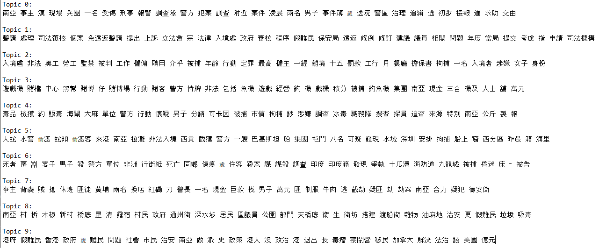

# Appendix: The Echoes of the Code {.unnumbered}

```{=latex}
\markboth{Appendix}{Appendix}
```

The goal of this appendix is to echo the code you used in your thesis for a greater sense of transparency and replicability of your research. Note that `ref.labels` can be set to any label. Hence, you can filter the code you want replicated in the appendix by setting labels to the desired code chunks in the various chapters. See [this excellent resource](https://bookdown.org/yihui/rmarkdown-cookbook/code-appendix.html) for more information.

This might be particularly useful when you perform model selection to output intermediary steps here instead of in the code to avoid cluttering your report.

```{r get-labels, echo = FALSE}
labs <- knitr::all_labels()
labs <- setdiff(labs, c("setup", "get-labels"))
```

```{r all-code, ref.label=labs, eval=FALSE}
```

# Appendix: The Echoes of the Code redux {.unnumbered}

Add as many appendices as you like.

```{python tuning_xgb, eval=FALSE, echo=TRUE}
from hyperopt import fmin, hp, tpe, Trials

xgb_space = {
  "n_estimators": hp.quniform("n_estimators", 10, 50, 5),
  "max_depth": hp.quniform("max_depth", 2, 6, 1), 
  "learning_rate": hp.quniform("learning_rate", 0.01, 0.3, 0.01),
  "gamma": hp.quniform("gamma", 0.1, 10, 0.1),
  "min_child_weight": hp.quniform("min_child_weight", 1, 10, 1),
  "subsample": hp.quniform("subsample", 0.5, 0.9, 0.1),
  "colsample_bytree": hp.quniform("colsample_bytree", 0.5, 0.9, 0.1),
  "reg_lambda": hp.quniform("reg_lambda", 1, 100, 1)
  }

def xgb_objective(params):
  xgboost_clf = xgb.XGBClassifier(objective="multi:softmax",
                                  eval_metric="mlogloss",
                                  random_state=1,
                                  use_label_encoder=False)
  xgb_params = {
  "n_estimators": int(params["n_estimators"]), 
  "max_depth": int(params["max_depth"]),
  "learning_rate": params["learning_rate"],
  "gamma": params["gamma"],
  "min_child_weight": int(params["min_child_weight"]),
  "subsample": params["subsample"],
  "colsample_bytree": params["colsample_bytree"],
  "reg_lambda": params["reg_lambda"]
  }
  loss = np.mean(- cross_val_score(xgboost_clf.set_params(**xgb_params), X_train_final, y_train, cv=five_fold_cv, scoring="neg_log_loss"))
  return loss

xgb_trials = Trials()
best_xgb_params = fmin(xgb_objective, xgb_space, algo=tpe.suggest, max_evals=500, rstate=np.random.seed(1), trials=xgb_trials)

```

```{python nmf_topic_word_list, eval=FALSE, echo=TRUE}
{python inspecting_topic_words}
# Defining a function to extract the most prominent words in each topic
def topic_words(model, vectorizer, top_n_words):
  vocabulary = vectorizer.get_feature_names()
  for idx, topic in enumerate(model.components_):
    print(f"\nTopic {idx}: ")
    print(" ".join([vocabulary[i] for i in topic.argsort()[:-top_n_words - 1: -1]]))

# Extracting the 30 most prominent words in each topic
_ = topic_words(nmf_10, tfidf_vec, 30)  # the output is shown in the figure below
```

```{r, fig.cap="Word list of each of the topics generated by the NMF model", out.width="100%"}

```

